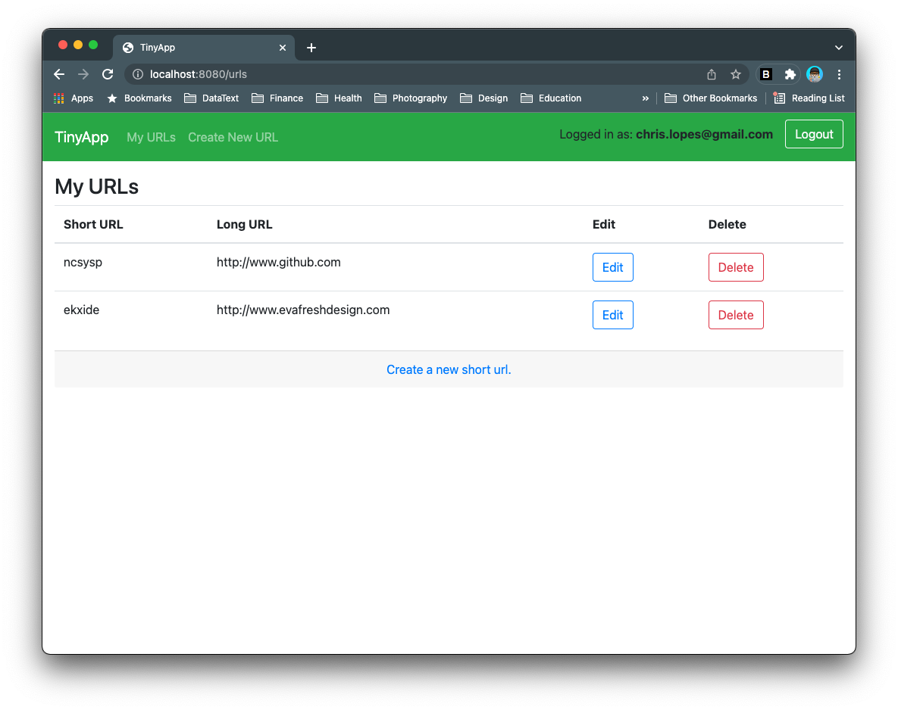
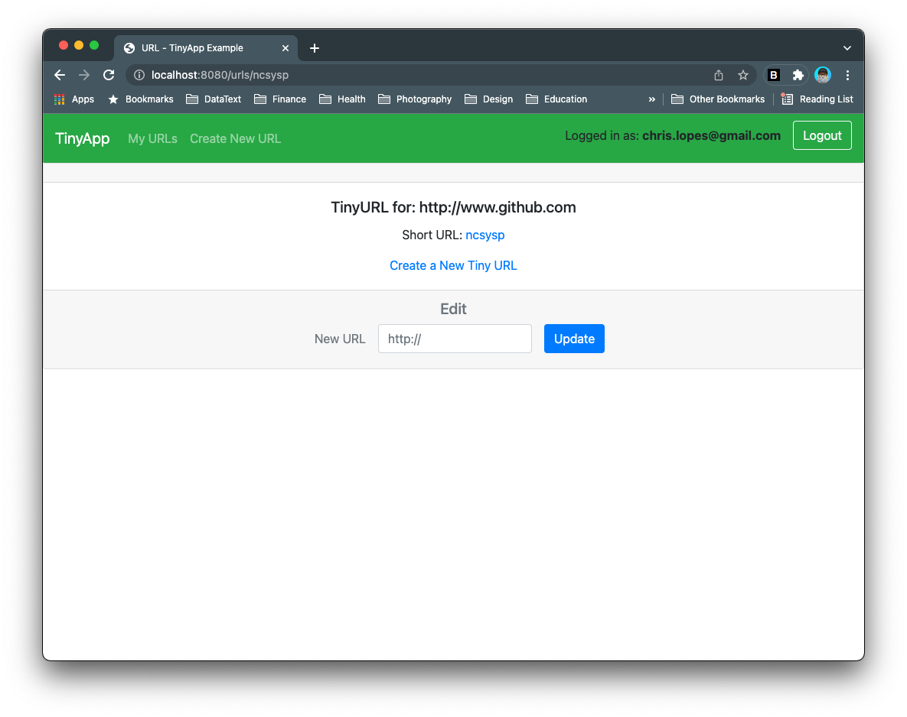
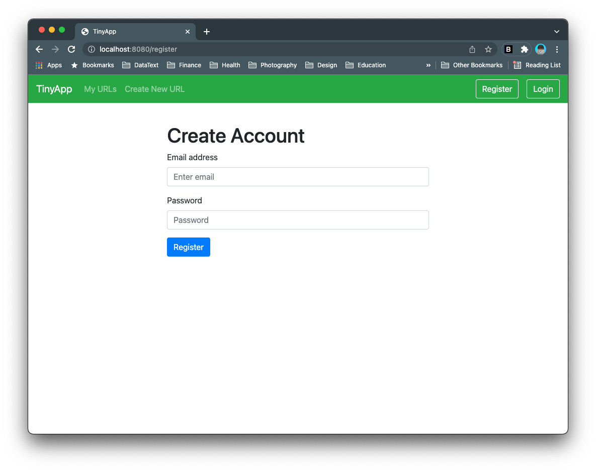

# tinyapp

TinyApp is a full stack web application built with Node and Express that allows users to shorten long URLs (à la bit.ly).

## Final Product







## Dependencies

- Node.js
- Express
- EJS
- bcrypt
- body-parser
- cookie-session

## Getting Started

- Install all dependencies (using the `npm install` command).
- Run the development web server using the `node express_server.js` command.

</br>

<hr>

</br>

## Developer Notes

### Nodemon

Nodemon is a utility that will monitor for any changes in our source code and automatically restart our server. Perfect for development.

`npm install nodemon --save-dev`

Run the app with `./node_modules/.bin/nodemon -L express_server.js`

To avoid using the previous code to start the app, we can add ascript to our JSON file.

```js
"scripts": {
  "start": "./node_modules/.bin/nodemon -L express_server.js",
  "test": "echo \"Error: no test specified\" && exit 1"
}
```

We can now start our app using `npm start`.

[Nodemon documentation](https://github.com/remy/nodemon#application-isnt-restarting)

</br>

### Node.js

[Node.js Documentation](https://nodejs.org/en/docs/)

</br>

### Express

[Express Documentation](https://expressjs.com/)

</br>

### EJS

[EJS Documentation](https://www.npmjs.com/package/bcryptjs)

</br>

### Bcryptjs

[Bcrypt Documentation](https://github.com/dcodeIO/bcrypt.js#readme)

</br>

### Body-parser

[Body-parser Documentation](https://www.npmjs.com/package/body-parser)

</br>

### Cookie-session

[Cookie-Session Documentation](https://www.npmjs.com/package/cookie-session)